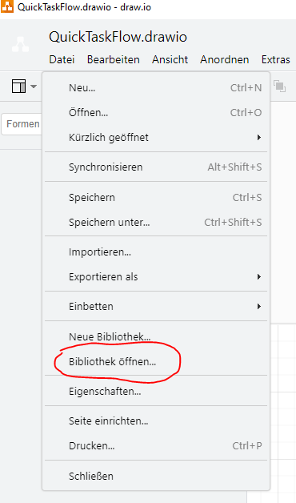
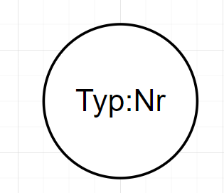
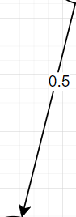

# Funktions Dokumentation

**NeuroNet** ist ein **Framework** für das Visuelle erstellen 
von neuronalen netzen.

## Form Biblothek

Die einzelnen Formen für **Drawio** können über **Biblothek öffnen** geladen werden.

Der Name der Biblothek ist **NeuroNetFormLib.xml**

## Formen

Es gibt die folgenden **Formen** :

### Neuronen

* **Nr** ist die Nummer des Neurons

* **Typ** Das ist der Typ des neurons. Dieser bestimmt die 
Aktivierungsfunktion

Es gibt die folgenden **Aktivierungsfunktion** :

* **lb**

        def LinearBool(x):

            if x>=0 :
                    return 1
            else:
                    return 0

* **B** ,  Der Bias

        def Bias(x):

 
          return 1

*  **Id** , Die Identitätsfunktion

        def Id(x):
            return x

***********
### Verbindungen und Gewichte

Die Verbindungen zwischen zwei Neuronen werden durch einen **Pfeil** dargestellt. Auf diesem wir ein Gewicht angebracht. Das Gewcicht kann in **Drawio** durch einen Doppelklick erzeugt werden.

## Konsolen Befehl

Der folgende Konsolenbefehl ruft **NeuroNet** auf :

     .\NeuroCreator.py [Name.drawio] [NameDiagramm]
    
* **Name.drawio** ist das drawio welches das Diagramm enthält

* **NameDiagramm** ist der Name des Diagramms