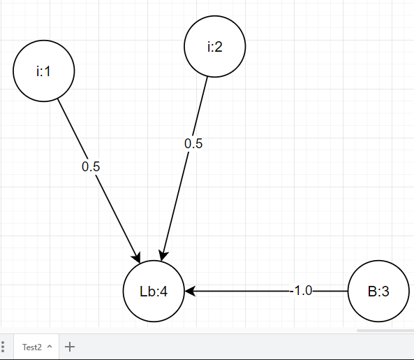
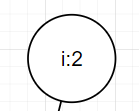
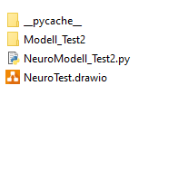

# NeuroNet

In diesem projekt wandeln wir **Diagramme** von Neuonalen netzen in 
ein Ausführbares **Modell** um.

## Inhaltsverzeichniss

1. [Quickstart](##Quickstart)
2. [FuncDoc](Doc/FuncDoc.md)
3. Mehr Besipiele

## Quickstart

Wir beginnen mit dem folgenden **Neuronalen-Netzt** das wir in
in **Drawio** erstellen. Diese ist ein einfaches logisches **And** .

Die **Kreise** stellen die einzelen Neuronen dar. 

Der **Syntax** im Neuron hat die folgenden bedeutung. 

 **i:2**  

 * **i** ist der Typ des Neurons, also i für Input Neuron  
 * **2** ist der Zeitpunkt, bei dem das Neuron aktiv wird.

 **********
 Mit dem folgenden Konsolen befehl erzeugen wir ein **Modell** für dieses Netz.

    .\NeuroCreator.py NeuroTest.drawio Test2

Es werden die folgenden **Files** erzeugt.

* **Modell_Test2** dort befindet sich das Übersetze Modell
* **NeuroModell_Test2.py** enthält einen **Algorithmus**, der das Netz 
aktiviert.

*********
Um das Netzt zu nutzen erstellen wir das folgende Python-Skript.

**Test_Agent.py**  :

    from NeuroModell_Test2 import RunNetwork_Test2

    Inp=[1,1]
    Neurons=RunNetwork_Test2(Inp)
    y=Neurons["4"][1]

    print("Die Ausgabe ist: "+str(y) )

In der ersten Zeile **importieren** wir die Funktion **RunNetwork_Test2**
von unserem Model. Die Variable **Inp** stellt den Input dar, dieser wird in die **Input-neuronen** eingelesen.  Also in unserem Fall in die neuronen
1 und 2. 

Die Funktion **RunNetwork_Test2(Inp)** aktiviert das Netz und aktualisiert jedes Neuron. 

Die Ausgabe ist der Dictonary **Neurons**:

    {'1': ['i', 1], '2': ['i', 1], '4': ['Lb', 1], '3': ['B', 1]}

Diese enthält als erstes die Nummer des neurons, als zweites **Typ** und den **Ausgabewert**.

*************

Der **Output** ist:

    Die Ausgabe ist: 1

